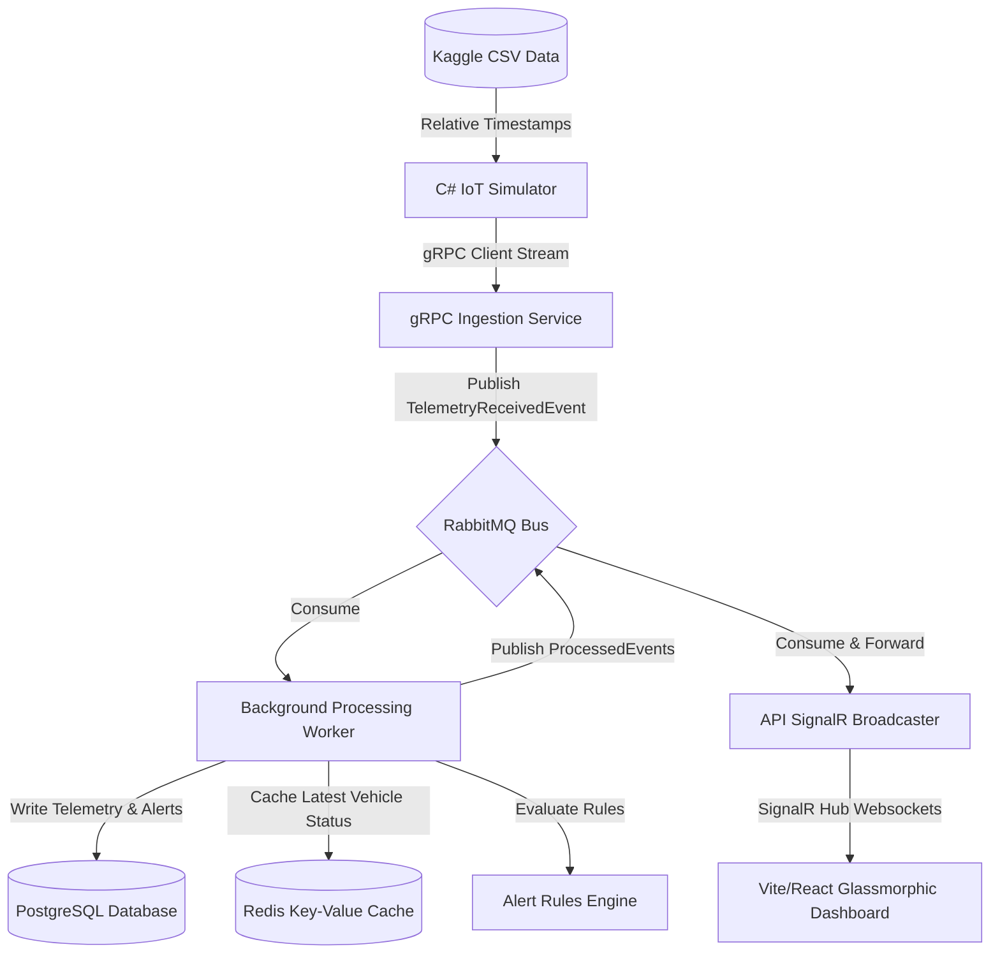

# Real-Time Vehicle Intelligence Platform

A high-performance, enterprise-grade IoT vehicle telemetry ingestion, alert processing, and real-time visualization platform built on **.NET 8 (C#)**, **gRPC streaming**, **Event-Driven Architecture (EDA)**, **PostgreSQL/EF Core**, **Redis**, **RabbitMQ (MassTransit)**, **SignalR**, and a **Vite + React** glassmorphic live dashboard.

The platform simulates real-time vehicle fleets by parsing and replaying a large-scale public dataset: **Vehicle Energy & Telemetry Dataset (Kaggle)**, mapping complex parameters (Mass Air Flow, HVAC thermal loads, elevation, speed limits), and dynamically calculating safety indicators and rule-based anomaly alerts.

---

## 🏗️ Architecture & Data Flow

The platform is designed using modern software patterns:
- **Clean Architecture**: Strong isolation of core business rules (Domain/Application) from external databases, protocols, UI, and brokers (Infrastructure/Presentation).
- **gRPC Client Streaming**: High-throughput ingestion channel streaming real-time telemetry from connected edge-simulators.
- **Event-Driven Brokerage**: MassTransit over RabbitMQ handles asynchronously dispatched event streams.
- **Rules Engine & Risk Scoring**: Rules evaluate speeding (against dynamic road limits), thermal spikes, and low battery, updating a rolling vehicle safety risk index.
- **SignalR Websockets**: The worker service publishes processed events to RabbitMQ, which the API consumes and broadcasts instantly to web clients.



---

## ⚡ Key Features

- **Dynamic Speed Limit Checks**: Upgraded from static speed limits. The rules engine compares current vehicle velocity with the road segment's dynamic speed limit from the Kaggle dataset, generating warnings accordingly.
- **Advanced Telemetry Analytics**: Maps 15+ complex metrics including Mass Air Flow (`MAF`), HVAC heating/cooling power consumption, elevation, battery voltage, and current.
- **Stablized Real-Time Web Console**: An interactive, glassmorphic UI visualizing vehicle states on a live tracking map (Leaflet) with pulsing colored markers representing real-time risk scores.
- **Live Alert Feed Isolation**: Allows users to filter globally broadcasted alerts down to a single selected vehicle, enabling clean isolation of anomaly events.
- **Robust Localization**: Handles timezone syncs (UTC parsing validations) and locale-invariant decimal configurations (guarding against regional comma/dot conversion bugs).

---

## 🚀 Getting Started

### Prerequisites
- [.NET 8 SDK](https://dotnet.microsoft.com/download/dotnet/8.0)
- [Node.js (v18+)](https://nodejs.org/)
- [Docker & Docker Desktop](https://www.docker.com/)

---

### 1. Kaggle Dataset Integration
1. Download the **Vehicle Energy & Telemetry Dataset** from [Kaggle](https://www.kaggle.com/datasets/yashdev01/vehicle-energy-and-telemetry-dataset).
2. Create a folder named `data` in the project root directory.
3. Extract and rename the CSV file to `vehicle_energy-telemetry.csv` and place it under the `data` folder:
   ```
   [Project Root]/data/vehicle_energy-telemetry.csv
   ```
   *(Note: This file is automatically ignored by `.gitignore` to prevent committing the 910MB dataset).*

---

### 2. Infrastructure Setup
Spin up PostgreSQL, Redis, and RabbitMQ containers locally:
```bash
docker compose up -d
```
*(EF Core database migrations are automatically checked and applied to the database on API startup).*

---

### 3. Launching the Services

Open separate terminals for each component to monitor logs:

*   **Terminal 1: REST & gRPC Ingestion API**
    ```bash
    dotnet run --project src/VehicleIntelligence.Api
    ```
    *API listens at HTTPS: `https://localhost:7084` | HTTP: `http://localhost:5020`*

*   **Terminal 2: Event-Driven Processing Worker**
    ```bash
    dotnet run --project src/VehicleIntelligence.Worker
    ```

*   **Terminal 3: Live Web Dashboard**
    ```bash
    cd src/VehicleIntelligence.Dashboard
    npm install
    npm run dev
    ```
    *Access the UI in your browser at `http://localhost:5173`*

*   **Terminal 4: IoT Telemetry Simulator**
    ```bash
    dotnet run --project src/VehicleIntelligence.Simulator
    ```
    *Streams telemetry rows into the gRPC channel, converting relative timestamps into real UTC timestamps.*

---

## 🔒 Security & Secrets Management

To prevent exposing passwords in source control, a multi-tiered environment variable strategy is implemented:

1. **Local Sandboxes**:
   `appsettings.json` uses safe default values targeting the local development docker containers out of the box.
2. **Local Overrides (User Secrets)**:
   For custom local credentials, use the .NET secret manager:
   ```bash
   dotnet user-secrets set "ConnectionStrings:PostgreSQL" "Host=localhost;Database=vehicleintelligence;Username=vehicleadmin;Password=CUSTOM_PWD" --project src/VehicleIntelligence.Api
   ```
3. **Environment Injection (Docker Compose)**:
   Copy `.env.template` to `.env` to override PostgreSQL and RabbitMQ credentials globally in local containers. The `.env` file is excluded from Git tracking.
   ```bash
   cp .env.template .env
   ```

---

## 🛠️ Technology Stack

- **Backend Core**: .NET 8, C#, ASP.NET Core Web API
- **Communication Protocol**: gRPC (Client-Streaming), WebSockets (SignalR)
- **Message Broker**: RabbitMQ, MassTransit (Event-Driven Integration)
- **Databases**: PostgreSQL (Relational Store), Redis (Latest State Cache)
- **ORM & Migrations**: Entity Framework Core (Code-First)
- **Frontend App**: Vite, React, Vanilla CSS variables, Leaflet (Maps), Lucide Icons
- **Logging & Diagnostics**: Serilog (Console, Rolling File logging), Correlation ID Middleware
